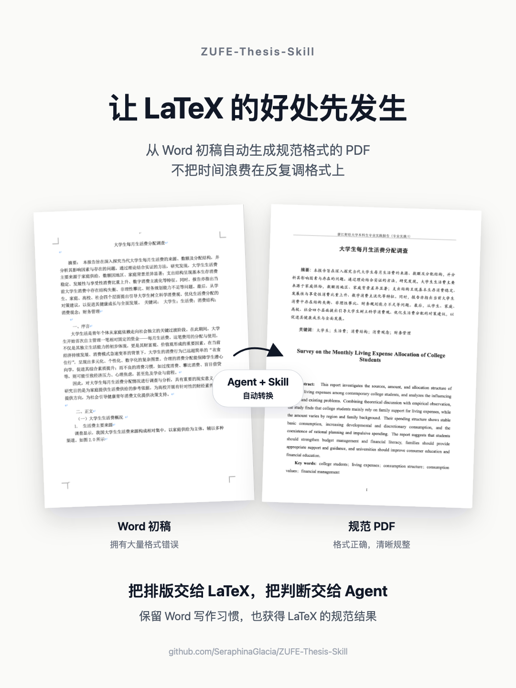

<p align="center">
  
</p>

<h1 align="center">ZUFE-Thesis-Skill</h1>

<div align="center">

<h3>致 谢</h3>

<p>
  本 Skill 面向并配合
  <a href="https://github.com/sqsssq/ZUFE-Thesis">sqsssq/ZUFE-Thesis</a>
  原始 LaTeX 模板使用。
</p>

<p>
  谨向模板作者
  <a href="https://github.com/sqsssq/">石青</a>
  学长，以及其所做的工作表示由衷的感谢。
</p>

</div>

---

本 Skill 依赖于原模板工作，如果没有它，本 Skill 也无从立足。本项目所做的，只是为它补充了更适合普通学生使用的 Agent Skill，让不会 LaTeX 的人，也能先享受到 LaTeX 规范排版带来的便利。

> [!NOTE]
> <details>
> <summary>🤔 我为什么要做这个项目？（推荐看看！）</summary>
>
> <h3>项目初衷：让 LaTeX 的好处先发生</h3>
>
> <p>本科阶段的论文、专业实践报告和课程小论文，真正消耗时间的地方往往不只是内容写作，而是大量重复、琐碎且容易出错的格式调整，相信各位同学或多或少“深受其害”。</p>
>
> <p>事实上，LaTeX 很适合解决这些问题。它能把内容和格式分开，让目录、编号、引用和参考文献自动保持一致。但对很多学生来说，LaTeX 的首次使用成本太高：要装环境、理解模板、学习语法，还要面对陌生的报错信息。而其极低的使用频率，却完全不足以摊薄学习成本。相比于投入较多的精力学习一项回报未知的技能，我相信大多数学生还是会选择继续使用较为熟悉且成熟的 Word。</p>
>
> <p>ZUFE-Thesis-Skill 的目标就是“让好处先发生”：你仍然可以用 Word 写初稿，然后让 Agent 借助这个 Skill 把 Word 内容写入 LaTeX 模板，生成符合格式要求的 LaTeX 工程和 PDF，而不需要进行任何手动排版。</p>
>
> <p>如果你并不想学习 LaTeX，也没有长期使用 LaTeX 的需求，本 Skill 与学校模板配合，也可以显著减少你无意义的重复劳动；当然，如果你愿意进一步了解 LaTeX，也可以把生成的工程文件作为一个温和的入门入口。这种路径比“先苦后甜”更加友好，也更符合真实的学习过程。</p>
>
> </details>

---

## 我适合用这个 Skill 吗？

如果你符合以下要求，那么恭喜你，这个 Skill 会非常适合你：

- 你正在写浙江财经大学本科毕业论文、专业实践报告或类似格式的课程论文。
- 你已经有 Word 初稿，但不想把时间花在反复调格式上。
- 你不熟悉 LaTeX，但希望得到可提交、可继续维护的 LaTeX 工程**或** PDF。
- 你对于 Agent Skill 有基本的认知。
- 你具备基本的操作 Agent 及其衍生工具（例如 Kimi Work、Codex）的能力。
- 你愿意在 AI 对话中确认少量关键信息，并配合 Agent 执行工作。

## 用了这个 Skill，我能得到什么？

一次完整转换后，你应该能得到：

- `main.pdf`：按 ZUFE-Thesis 模板编译出的 PDF。
- 可继续修改的 LaTeX 工程：包括章节、图片、参考文献和基础信息文件。

当然，你也会同时得到 `report.md`，`qa_report.md` 等用来记录转换过程、确认事项和相关说明的记录文档。如果你需要对工作过程进行检查，这些文档可以帮助你。

## 那该如何使用呢？（快速开始）

1. 先准备一个完整的 ZUFE-Thesis 模板项目。

   模板优先使用 GitHub 仓库：[ZUFE-Thesis](https://github.com/sqsssq/ZUFE-Thesis)。如果 GitHub 因网络环境不可用，可以改用国内备用链接：[Gitee 镜像](https://gitee.com/cwf818/ZUFE-Thesis)。

2. 在 Kimi Work / Codex 等工具中打开这个完整的 ZUFE-Thesis 模板项目。

3. 然后，在目标工作区安装本 Skill：

   ```bash
   # 推荐使用 npx skills add 命令
   npx skills add SeraphinaGlacia/ZUFE-Thesis-Skill
   ```

> [!WARNING]
> 本 Skill 需要与模板项目存在于同一个工作区，请务必保证在已有的模板项目库中安装本 Skill，否则其将无法正常工作。

4. 将 Word 同样存放于工作区中，准备好后，直接在对话中说明你的目标，例如：

   ```text
   请帮我把 XXX.docx 转换为 LaTeX 工程和 PDF。
   ```

通常而言，你不需要有任何 LaTeX 基础和环境配置基础，只要把 Word 文档交给 Agent 处理就可以了。你不需要过分担心会出现你无法处理的问题，Agent 会尽力帮你自动解决。

Agent 会按流程检查模板、环境、输入文件和元数据，并开始写入、编译。当遇到不确定内容时，它也会先向你确认，而不是猜测。

> [!WARNING]
> 虽然 Agent 会尽量自动推进完整流程，但最终输出的 PDF 依旧可能存在一些错误，例如：缺失部分标点符号、标题重复编号、章节识别错误等，请务必对输出的 PDF 进行检查，并与 AI 进一步交流修改。不要未经检查直接提交。

## 如何保证可靠？

这个 Skill 会把容易出错的地方显式暴露出来，尽力确保最终产物是符合规范的：

- 转换前会先做门禁检查，确认当前目录确实是 ZUFE-Thesis 模板项目，且环境配置正确。
- 遇到 Word 中无法确认的内容（章节、摘要、关键词、参考文献、图表标题等），会进入确认流程，等待用户确认。
- 不静默丢弃暂不支持的内容，例如脚注、批注、文本框等。
- 编译后会生成质检报告，说明 PDF 质量校验结果、是否还有模板残留或占位符。

## Skill 文件结构

<details>
<summary>展开查看 <code>zufe-thesis-typesetter</code> 文件结构</summary>

```text
zufe-thesis-typesetter/
├── SKILL.md                             # Skill 入口
├── agents/
│   └── openai.yaml                     # Agent 配置
├── assets/
│   └── metadata.example.yaml           # 元数据示例
├── references/
│   ├── environment-setup-and-repair.md # 环境修复
│   ├── flow-a-gatekeeping.md           # 流程 A Workflow
│   ├── flow-b-conversion.md            # 流程 B Workflow
│   ├── flow-c-export-and-qa.md         # 流程 C Workflow
│   └── thesis-json-schema.md           # JSON Schema
├── scripts/
│   ├── build.py                        # 编译脚本
│   ├── check_env.py                    # 环境检查脚本
│   ├── check_flow_b_gate.py            # B 流程门禁脚本
│   ├── check_template.py               # 模板检查脚本
│   ├── common.py                       # 共享工具脚本
│   ├── diagnose_build.py               # 编译诊断
│   ├── export_assets.py                # 资源导出脚本
│   ├── import_docx.py                  # DOCX 抽取脚本
│   ├── prepare_workspace.py            # 工作区准备脚本
│   ├── prescan_docx.py                 # DOCX 预扫描脚本
│   ├── qa.py                           # 质量检查脚本
│   ├── render_basicinfo.py             # 基础信息渲染脚本
│   ├── render_bib.py                   # 参考文献渲染脚本
│   └── render_chapters.py              # 章节渲染脚本
└── tests/
    ├── test_regressions.py             # 回归测试脚本
    └── test_render_chapters.py         # 渲染测试脚本
```

</details>

## ⚠️ 注意

> [!CAUTION]
> 使用前请务必先备份原始 Word、模板工程和重要输出文件；任何因使用本 Skill 导致的文档损坏、内容丢失或数据丢失，均不由本项目承担责任。

> [!IMPORTANT]
> 本项目是配合 [sqsssq/ZUFE-Thesis](https://github.com/sqsssq/ZUFE-Thesis) 使用的非官方辅助 Skill，不代表浙江财经大学官方工具，也不是原始模板项目的官方组成部分。最终格式仍以学校要求、导师要求和原始模板为准。

> [!IMPORTANT]
> 原始 ZUFE-Thesis 模板项目有其自身的作者和许可证；本仓库只维护与其相关的 Skill。本仓库代码以 GNU AGPL-3.0 发布，详见 [LICENSE](LICENSE)。

---

<div align="center">
  <p>Made with ❤️ by SeraphinaGlacia / Xinlei Zhou</p>
</div>
