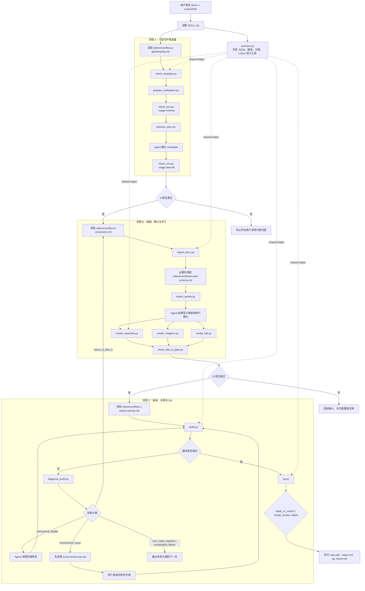

# ZUFE-Thesis-Skill 包内部执行流程

本文档说明 `zufe-thesis-typesetter/` 这个 Skill 包内部如何调动 `SKILL.md`、`references/`、`scripts/`、`tests/`，完成一次 Word 到 ZUFE-Thesis LaTeX/PDF 的转换。

## 概览

| 位置 | 内部职责 | 参与时机 |
| --- | --- | --- |
| `SKILL.md` | 定义触发条件、核心契约、A/B/C 总流程、质量硬约束和 Agent 职责 | 每次 Skill 被调用时先读 |
| `assets/metadata.example.yaml` | 提供 metadata 示例结构 | 用户或维护者需要了解输入字段时参考 |
| `references/` | 保存流程 A/B/C、环境修复和 `thesis.json` 契约 | 进入对应阶段前读取 |
| `scripts/` | 执行模板检查、工作区整理、DOCX 抽取、LaTeX 写入、编译、诊断和 QA | 由 Agent 按流程调度 |
| `tests/` | 固化关键风险的回归测试 | 修改 Skill 行为或脚本后运行（备用，因为 Agent 确实可以修改 scripts） |

即，Agent 负责语义判断、风险解释和用户确认；scripts 负责稳定的文件读写、抽取、渲染、编译和检查；最终格式仍然依照 ZUFE-Thesis 模板生成。

## 运行调度图

## 数据流图

```mermaid
flowchart LR
    root["ZUFE-Thesis 模板根目录"] --> checkTemplate2["check_template.py"]
    sourceWord["用户提供的 Word"] --> prepareWorkspace2["prepare_workspace.py"]
    checkTemplate2 --> prepareWorkspace2
    prepareWorkspace2 --> docx["workspace/input/thesis.docx"]
    prepareWorkspace2 --> meta["workspace/input/metadata.yaml"]

    checkEnvMin2["check_env.py<br/>--stage minimal"] --> prescan2["prescan_docx.py"]
    docx --> prescan2
    prescan2 --> candidates["metadata 候选"]
    candidates --> meta

    checkEnvLatex2["check_env.py<br/>--stage latex/all"] --> build2["build.py"]

    docx --> import2["import_docx.py"]
    import2 --> json["workspace/intermediate/thesis.json"]
    import2 --> extracted["workspace/intermediate/extracted.md"]

    json --> export2["export_assets.py"]
    export2 --> images["Images/word_media/"]
    export2 --> json

    json --> basicinfo2["render_basicinfo.py"]
    meta --> basicinfo2
    basicinfo2 --> basicTex["chapters/basicinfo.tex"]
    basicinfo2 --> json

    json --> chapters2["render_chapters.py"]
    chapters2 --> body["chapters/mainbody.tex"]
    chapters2 --> chapterTex["chapters/*.tex"]
    chapters2 --> json

    json --> bib2["render_bib.py"]
    bib2 --> refBib["Reference.bib"]
    bib2 --> json

    json --> gate2["check_flow_b_gate.py"]
    basicTex --> gate2
    body --> gate2
    chapterTex --> gate2
    refBib --> gate2
    gate2 --> build2

    build2 --> pdf["main.pdf"]
    build2 --> report["workspace/output/report.md"]
    build2 --> buildJson["workspace/output/build_result.json"]
    build2 -- "编译失败" --> diagnose2["diagnose_build.py"]
    diagnose2 --> diagnosis["workspace/output/diagnosis.json"]
    diagnosis --> report

    pdf --> qa2["qa.py"]
    json --> qa2
    buildJson --> qa2
    qa2 --> qaReport["workspace/output/qa_report.md"]
    qa2 --> qaJson["workspace/output/qa_result.json"]

    common2["common.py<br/>共享工具"] -.-> checkTemplate2
    common2 -.-> prepareWorkspace2
    common2 -.-> import2
    common2 -.-> basicinfo2
    common2 -.-> build2
    common2 -.-> qa2
```

## references 何时被读取

`SKILL.md` 只保留总体信息和一些约束，细节工作步骤由 `references/` 承担。这样可以让 Skill 入口保持可读，也符合渐进式披露的设计原则。

| references | 读取时机 | 主要内容 |
| --- | --- | --- |
| `flow-a-gatekeeping.md` | 做流程 A 前 | 当前目录是不是模板根目录，输入和环境是否足以进入转换 |
| `environment-sop.md` | 做环境判断或环境修复前 | 按 profile 和 issue code 判断下一步 |
| `environment-setup-and-repair.md` | 需要平台命令、安装细节、PATH 修复或 TeX 包补装时 | 具体命令、成本和安全边界 |
| `flow-b-conversion.md` | 正式抽取、语义映射、渲染前 | 如何做到无静默丢失、无静默错放 |
| `thesis-json-schema.md` | 手动编辑或判断 `thesis.json` 时 | 源块、状态、确认、渲染记录应该怎么写 |
| `flow-c-export-and-qa.md` | 编译、诊断、QA 前 | 如何生成新 PDF，如何分类失败，如何判断交付状态 |

读取 `references/` 可以给每个阶段建立边界，这也就是为什么 A/B/C 三个流程存放在三个不同的文件里。每个流程不能越界，例如：流程 A 不做转换，流程 B 不安装环境和编译，流程 C 不重新判断语义。

## scripts 调用顺序

下面是一次完整转换中，Skill 内部推荐的脚本调度顺序。具体执行时，Agent 会根据 JSON 输出、用户确认和失败分类决定是否暂停、重试或回退。

### 流程 A：门禁与环境准备

| 顺序 | script | 作用 |
| --- | --- | --- |
| 1 | `check_template.py` | 检查当前目录是否是 ZUFE-Thesis 模板根目录 |
| 2 | `prepare_workspace.py` | 创建 `workspace/`，整理 Word 输入，按批准归档旧输出 |
| 3 | `check_env.py --stage minimal` | 确认 Python 和 `python-docx` 能支持 DOCX 预扫描 |
| 4 | `prescan_docx.py` | 轻量读取 Word，生成 metadata 候选，不生成正式 `thesis.json` |
| 5 | Agent 确认 metadata | 向用户确认 `report_style`、题目、学院、专业、导师等封面字段 |
| 6 | `check_env.py --stage latex` | 确认 `xelatex`、`biber` 和关键 TeX 包可用 |

流程 A 的输出是标准输入和可继续执行的环境：`workspace/input/thesis.docx`、`workspace/input/metadata.yaml`、安全的旧产物状态，以及足够进入流程 B/C 的依赖条件。

### 流程 B：抽取、确认与写入

| 顺序 | script | 作用 |
| --- | --- | --- |
| 1 | `import_docx.py` | 正式抽取 DOCX，生成 `thesis.json` 和 `extracted.md` |
| 2 | `export_assets.py` | 把 DOCX 媒体复制到 `Images/word_media/`（但不替代语义确认） |
| 3 | Agent 语义确认 | 处理章节、摘要、关键词、图表、公式、参考文献、致谢、附录等归属 |
| 4 | `render_basicinfo.py` | 写入 `chapters/basicinfo.tex`，并执行 metadata/英文内容门禁 |
| 5 | `render_chapters.py` | 写入 `chapters/*.tex` 和 `chapters/mainbody.tex` |
| 6 | `render_bib.py` | 写入已确认的 `Reference.bib` 参考文献 |
| 7 | `check_flow_b_gate.py` | 阻止未确认、未写入、未处理或风险未解决的源块进入流程 C |

流程 B 的核心产物是一个已经写入模板、且由 `thesis.json` 证明内容没有被静默丢弃或错误放置的 LaTeX 草稿。

### 流程 C：编译、诊断与 QA

| 顺序 | script | 作用 |
| --- | --- | --- |
| 1 | `build.py` | 归档旧 `main.pdf`，清理临时文件，运行固定编译链 |
| 2 | `diagnose_build.py` | 编译失败时分类问题，给出可行动下一步 |
| 3 | Agent 有限机械修复 | 只允许修路径、转义、资源目录、临时文件污染等非语义问题（因为语意问题由流程 B 管制） |
| 4 | `build.py` | 修复后按规则重试编译 |
| 5 | `qa.py` | 检查 PDF 文本、引用、模板残留、占位符和关键源文件风险 |

流程 C 的输出是 `main.pdf`、`workspace/output/report.md`、`workspace/output/qa_report.md`，以及 `ready_to_submit`、`needs_review` 或 `failed` 的交付状态。

## scripts 表

| script | 所属阶段 | 内部职责 |
| --- | --- | --- |
| `common.py` | shared | 提供 JSON、路径、归档、LaTeX 转义等共享工具 |
| `check_template.py` | A | 验证模板签名，避免在错误目录写入 |
| `prepare_workspace.py` | A | 创建标准 workspace，整理输入和旧输出 |
| `check_env.py` | A/C | 检查 Python DOCX 环境、LaTeX/Biber、QA 工具和关键包，并输出环境 issue code |
| `prescan_docx.py` | A | 轻量预扫描 Word，提取 metadata 候选 |
| `import_docx.py` | B | 正式抽取源块、run 级证据和 unsupported features |
| `export_assets.py` | B | 导出 DOCX 媒体资源，并回写资源证据 |
| `render_basicinfo.py` | B | 渲染封面、摘要、关键词和超链接隐藏设置 |
| `render_chapters.py` | B | 渲染章节正文、标题、表格、图片引用和 `mainbody.tex` |
| `render_bib.py` | B | 写入已确认 BibTeX |
| `check_flow_b_gate.py` | B | 检查流程 B 是否真的完成 |
| `build.py` | C | 归档旧 PDF，运行 `xelatex -> biber -> xelatex -> xelatex` |
| `diagnose_build.py` | C | 把编译失败转成问题分类 |
| `qa.py` | C | 生成 QA 结果和最终状态 |

这个表也说明了我设计时的一个原则：如果某个规则能用脚本稳定检查，就应该尽量使用脚本和测试来检查它；如果它依赖语义判断，那就应该留给 Agent，并在 `thesis.json` 或报告里留下证据。

## tests 在流程中的意义

`tests/` 是维护 Skill 时才使用的。它们验证被修改过后的 Skill 能否正常工作（便于开发，以及工作中 Agent 需要修改 Skill 文件的情况）。

| tests | 主要覆盖目标 |
| --- | --- |
| `test_regressions.py` | DOCX run 级格式、图片锚点、unsupported features、环境提示、metadata 门禁、英文内容授权、BibTeX/引用 QA、路径越界、B 流程门禁、表格缩放风险、PDF fresh 和页数统计 |
| `test_render_chapters.py` | 章节标题层级渲染 |

## 失败退回

本 Skill 的退回规则如下：

- 流程 A 失败：停止在输入、模板或环境门禁，不进入正式抽取。
- 流程 B 失败：停止在语义确认或模板写入，不进入编译。
- 流程 C 失败：先分类；机械问题可有限修复，语义问题必须回到流程 B，环境问题必须先读取 `environment-sop.md`，需要具体平台修复时再读取环境修复 reference，并获得用户批准。
- QA 给出 `needs_review`：PDF 可以存在，但不能证明完全没有错误；必须把风险说明给用户。

这也是为什么 `report.md`、`qa_report.md` 和 JSON 结果很重要：它们让 Agent 能把内部失败状态翻译成用户能理解的下一步，而不是只把 LaTeX 日志或 Python 报错呈现出来。
